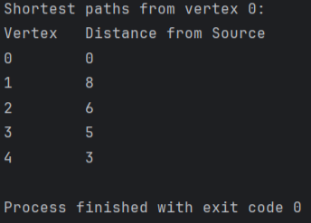

# Bonus Task: Dijkstra's Algorithm

## Description
This project implements **Dijkstra's Shortest Path Algorithm** in Java. The algorithm finds the shortest path from a given source vertex to all other vertices in a weighted directed graph.

## Project Structure
```
src/
├── Main.java    - Entry point, creates the graph and runs Dijkstra
├── Graph.java   - Graph class with adjacency list and Dijkstra implementation
└── Edge.java    - Edge class representing weighted directed edges
```

## How It Works

### Graph Representation
The graph is represented using an **Adjacency List** (`List<List<Edge>>`), where each vertex stores a list of its outgoing edges with their weights.

### Algorithm Steps
1. Initialize all distances as `Integer.MAX_VALUE` (infinity), except the source vertex which is set to `0`.
2. For each iteration, select the unvisited vertex `u` with the minimum distance.
3. Mark `u` as visited.
4. For each neighbor `v` of `u`, if `dist[u] + weight(u, v) < dist[v]`, update `dist[v]`.
5. Repeat until all vertices are visited.

### Time Complexity
- **O(V²)** — since a simple loop is used to find the minimum distance vertex instead of a `PriorityQueue`.
- With a `PriorityQueue`, the complexity would be **O((V + E) log V)**.

## Example Graph
The program creates a directed weighted graph with **5 vertices** and the following edges:

| Source | Destination | Weight |
|--------|-------------|--------|
| 0      | 1           | 9      |
| 0      | 2           | 6      |
| 0      | 3           | 5      |
| 0      | 4           | 3      |
| 2      | 1           | 2      |
| 2      | 3           | 4      |

## Output
Running Dijkstra from vertex `0`:

```
Shortest paths from vertex 0:
Vertex   Distance from Source
0        0
1        8
2        6
3        5
4        3
```

> Note: Vertex 1 has distance **8** (path: 0 → 2 → 1, cost: 6 + 2) instead of the direct edge weight 9.

## Screenshot


## How to Run
1. Navigate to the `src/` folder
2. Compile: `javac Main.java Graph.java Edge.java`
3. Run: `java Main`
